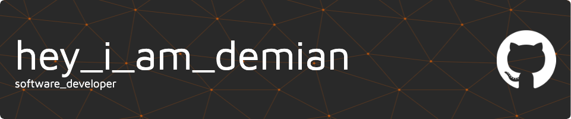

# I've got 99 problems and horizontal overflow is several of them.
### ❓ About me
My name is Demian, and i'm a software developer based in Germany📍

🏦 Software developer at <a href=https://hmstr.de/>hmstr</a>

### 👨🏼‍💻 Development enviroment

### 🛠 Languages & Tools

]

]

]

<!--
**dmarkenstein/dmarkenstein** is a ✨ _special_ ✨ repository because its `README.md` (this file) appears on your GitHub profile.

Here are some ideas to get you started:

- 🔭 I’m currently working on ...
- 🌱 I’m currently learning ...
- 👯 I’m looking to collaborate on ...
- 🤔 I’m looking for help with ...
- 💬 Ask me about ...
- 📫 How to reach me: ...
- 😄 Pronouns: ...
- ⚡ Fun fact: ...
-->
